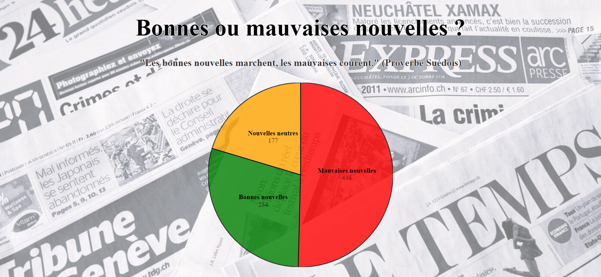

# Bonne-ou-mauvaise-nouvelle-
Ce projet a été développé dans le cours de [Visualisation de données](https://applicationspub.unil.ch/interpub/noauth/php/Ud/ficheCours.php?v_enstyid=78116&v_ueid=174&v_etapeid1=29023&v_langue=fr&v_isinterne=1) donné par Isaac Pante à l'Université de Lausanne en printemps 2022.
Il s'agit d'une visualistion simple sous forme de PieChart pour analyser le nombre de bonnes et de mauvaises nouvelles publiées sur le site de [RTSinfo](https://www.rts.ch/info/).

## But du projet
Nous vivons aujourd'hui dans un monde au flux d'informations constant. Que ce soit les chaînes d'info en continu à la télévision, sur les réseaux sociaux ou dans les médias tradtionnels, nous sommes bombardé.e.s de nouvelles du monde entier. Et dans ce flot de nouvelles, ce sont souvent les plus mauvaises qui retiennent notre attention. C'est dans ce contexte que je me suis demandées si les médias publiaient effectivement plus de mauvaises nouvelles ? Ou si cela n'était qu'une fausse impression dûe au fait que les mauvaises nouvelles nous marqueraient plus que les bonnes ?

## Récolte des données
Pour répondre à mon questionnement, j'ai décidé de repertorier, pendant un mois, l'ensemble des nouvelles publiées sur le portail [RTSinfo](https://www.rts.ch/info/). J'ai choisi ce médias pour deux raisons. La première concerne la diversité des nouvelles qui traitent de sujets régionaux, nationaux et internationaux, avec des formats assez courts. La deuxième raison est plus subjective. Je me renseigne principalement via ce canal.
Ce point me permet d'aborder un autre élément important de cette récolte de données : sa subjectivité. En effet, je me suis basée principalement sur mes impressions pour classer les différentes nouvelles. Une nouvelle que je considère comme mauvaise (le résultat d'une votation par exemple) aurait pu être vue comme une bonne nouvelle pour d'autres personnes.

Du 18 juin au 17 juillet 2022, j'ai donc scruté et classé ces nouvelles dans un dossier CSV en leur attribuant les valeurs suivantes :
1. Quelle émotion ? (bonne, mauvaise, neutre)
2. La date et le jour de publication
3. Un lien HTML qui permet de retouver la nouvelle

## Création de la visualisation
A partir des données que j'avais récolté, je me suis chargée de faire un PieChart grâce à D3.js. Je me suis aidée de différents exemples de PieChart qui étaient disponible sur la [galerie d'Observable](https://observablehq.com/@d3/gallery) ainsi que du livre "D3.js Quick Start Guide" écrit par Matthew Huntington en 2018.
J'ai ajouté quelques animations à mon PieChart pour le rendre plus sympathique dont la possibilité d'ouvrir une nouvelle page avec une bonne, une mauvaise ou une nouvelle neutre selon un clique sur la section du graphique coresspondante.

## Résultat final

La visualisation montre clairement une prépondérance des mauvaises nouvelles (plus de la moitié) alors que les bonnes nouvelles et les neutres se partagent l’autre moitié. De plus les mauvaises nouvelles sont souvent plus conséquentes que les bonnes, je vous laisse cliquer pour le constater par vous même.
Malgré cela j’ai été agréablement surprise pendant ma récolte de données du nombre de bonnes nouvelles. Je ne les aurais pas forcément lues au quotidien, les titres des mauvaises me faisant plus facilement cliquer.
