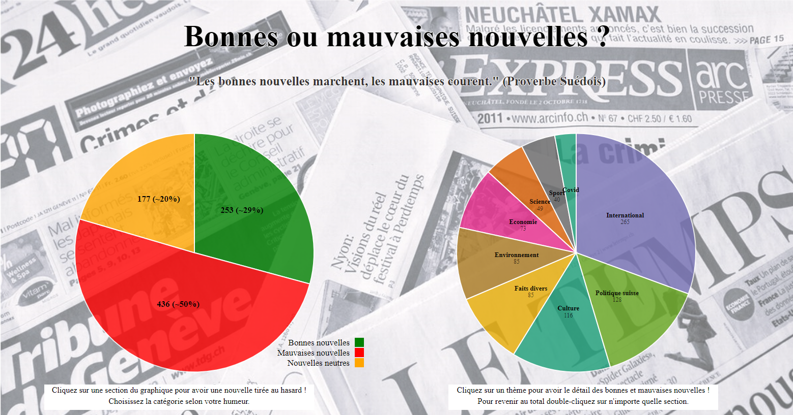

# Bonne-ou-mauvaise-nouvelle-
Ce projet a été développé dans le cours de [Visualisation de données](https://applicationspub.unil.ch/interpub/noauth/php/Ud/ficheCours.php?v_enstyid=78116&v_ueid=174&v_etapeid1=29023&v_langue=fr&v_isinterne=1) donné par Isaac Pante à l'Université de Lausanne en printemps 2022.
Il s'agit d'une visualisation simple sous forme de PieChart pour analyser le nombre de bonnes et de mauvaises nouvelles publiées sur le site de [RTSinfo](https://www.rts.ch/info/).

## But du projet
Nous vivons dans un monde au flux d'informations constant. Que ce soit les chaînes d'info en continu à la télévision, sur les réseaux sociaux ou dans les médias traditionnels, nous sommes bombardé.e.s de nouvelles venant du monde entier. Et dans ce flot de nouvelles, ce sont souvent les plus mauvaises qui retiennent notre attention. C'est dans ce contexte que je me suis demandé si les médias publiaient effectivement plus de mauvaises nouvelles ? Ou si cela n'était qu'une fausse impression due au fait que les mauvaises nouvelles nous marqueraient plus que les bonnes ?

## Récolte des données
Pour répondre à mon questionnement, j'ai décidé de répertorier, pendant un mois, l'ensemble des nouvelles publiées sur le portail [RTSinfo](https://www.rts.ch/info/). J'ai choisi ce média pour deux raisons. La première concerne la diversité des nouvelles qui traitent de sujets régionaux, nationaux et internationaux, avec des formats assez courts qui reste purement informatif. La deuxième raison est plus subjective. Je me renseigne principalement via ce canal et je consulte rarement d'autres médias.
Ce point me permet d'aborder un autre élément important de cette récolte de données : sa subjectivité. D'une part, j'ai choisi d'analyser uniquement une plateforme appartenant à un seul média et d'autre part, je me suis basée principalement sur mes impressions pour classer les différentes nouvelles. Une nouvelle que je considère comme mauvaise (le résultat d'une votation par exemple) aurait pu être vue comme une bonne nouvelle pour d'autres personnes. Le résultat final est donc principalement pertinent pour moi-même mais il faudrait peut-être refaire une base de données pour l'appliquer à soi-même ou à un plus large public.

Du 18 juin au 17 juillet 2022, j'ai donc scruté et classé ces nouvelles dans un dossier CSV en leur attribuant les valeurs suivantes :
##### 1. Quelle émotion ? 
  - **Bonne** Pour les nouvelles que j’estimais positives. On retrouve dans cette catégories toutes les nouvelles qui traitent de progrès et de mouvements sociaux, de découvertes scientifiques, de résolution de conflit, d’événements culturels progressistes et quelqu’unes qui m’ont faites rire comme [une nouvelle sur l'anniversaire du Kebab](https://www.rts.ch/info/monde/13194806-le-kebab-veritable-icone-culturelle-en-allemagne-souffle-ses-50-bougies.html). J'attribuais donc cette valeur à des informations qui me réjouissait ou qui abordait des sujets légers.
  - **Mauvaise** Pour les nouvelles que j’estimais négatives. J’ai choisis cette valeur dès qu’il était question de décès de personnes, de blessé.es, de catastrophes naturelles, de conflit armés, d’accidents, de politiques conservatrices, de la crise énergitique et économique ou encore des informations sur la météo qui me rappelait le réchauffement climatique (la récolte ayant eu lieu pendant une période de forte chaleur).
  - **Neutre** Pour les nouvelles auxquelles je n’arrivais pas à attribuer une émotion positive ou négative. On retrouve dans cette catégorie principalement des critiques culturelles, des faits divers, des publications d'études scientifiques ou des interviews de personnes qui me sont inconnues. 
##### 2. La thématique traitée dans l'article
  - **International** Pour toutes les nouvelles sur la géopolitique entre les pays; les conflits internes ou entre nations; les élections et décisions politiques des pays étrangers; Internet et les réseaux sociaux; les organisations non gouvernementales.
  - **Culture** Pour toutes les nouvelles qui parlaient de cinémas; de spectacles; d'expositions; d’artistes; de concerts; de festivals; d’histoire ; de littératures. 
  - **Politique Suisse** Pour toutes les nouvelles sur les élections et votations cantonales ou nationales; les interviews de personalités politiques; les manifestations; la mise en place de politiques ou de lois.
  - **Économie** Pour toutes les nouvelles sur les indicateurs économiques comme les monnaies; la crise économique; les entreprises privées ou les PME.
  - **Environnement** Pour celles qui parlaient de climat et d'événements causés par ce dernier; de catastrophes naturelles; du monde animal.
  - **Sciences**  Pour les nouvelles qui parlaient d’avancées techniques; de découverte scientifique; de résultats d’étude; de santé.
  - **Sport** Pour les nouvelles sur les événements sportifs; les résultats de compétition; les personnalités du sport.
  - **Faits divers** Pour les nouvelles portant sur des événements uniques comme les décès ou les anniversaires; les procès; les accidents.
  - **Covid** Pour les nouvelles mentionnant la pandémie du Covid ou ses impacts sur la société.
##### 3. La date et le jour de publication
##### 4. Un lien HTML qui permet de retrouver la nouvelle

## Création de la visualisation
À partir des données que j'avais récoltées, je me suis chargée de faire deux PieChart grâce à la bibliothèque [D3.js](https://d3js.org/). Je me suis aidée de différents exemples de PieChart qui étaient disponibles sur la [galerie d'Observable](https://observablehq.com/@d3/gallery) ainsi que du livre *D3.js Quick Start Guide* écrit par Matthew Huntington en 2018.
Le premier PieChart (à gauche) représente le nombre de nouvelles liées à chaque émotion ainsi que les pourcentages de chaque catégorie. Le deuxième PieChart (à droite) montre le nombre de nouvelles liées à chaque thématique.
J'ai ajouté une animation à mon PieChart sur les émotions pour avoir la possibilité d'ouvrir une nouvelle page avec une bonne, une mauvaise ou une nouvelle neutre selon un clic sur la section du graphique corresspondante. 
Des animations sur le deuxième PieChart permettent de visualiser le détail des bonnes, mauvaises et nouvelles neutres selon la thématique abordée en cliquant sur la section coresspondante. Le clic va alors modifier les valeurs du premier PieChart sur les émotions.

## Résultat final

La visualisation montre clairement une prépondérance des mauvaises nouvelles avec 50% du total alors que les bonnes nouvelles et les neutres se partagent l’autre moitié. De plus les mauvaises nouvelles sont souvent plus conséquentes que les bonnes, je vous laisse cliquer pour le constater par vous-même.
Malgré cela j’ai été agréablement surprise pendant ma récolte de données du nombre de bonnes nouvelles. Je ne les aurais pas forcément lues au quotidien, les titres des mauvaises me faisant plus facilement cliquer.

Pour ce qui est des thématiques, on retrouve en première ligne les nouvelles sur l'international qui peut jusitifer par le fait que la RTS est un média national qui va plus s'intéresser à des événements nationaux ou internationaux. Par ailleurs, la politique Suisse se trouve en deuxième position suivit de près par les nouvelles sur la culture. Les nouvelles sur les faits divers, l'environnement et l'économie se partagent un tiers du total. Pour terminer le classement on retrouve les quelques nouvelles sur la science, le sport ou le Covid.

Pour voir le détail de chaque bonnes et mauvaises nouvelles par catégorie, il suffit de cliquer sur la section du graphique concernée.

Je m'attarderais spécialement sur la catégorie environnement ici. La majorité des nouvelles sont mauvaises (70 sur 85) et seulement 15 sont bonnes. Cela s'explique par un grand nombre de nouvelles faisant état de dérangement climatique qui provoque des dégats à l'environnement. De plus, ma période de récolte a eu lieu pendant un été caniculaire. Un autre éléement à relever est l'absence de nouvelles neutres pour cette thématique, cela se justifie car c'est un sujet qui me tient à coeur, les nouvelles concernant l'environnement vont donc forcément me toucher de façon négative ou pisitive.

